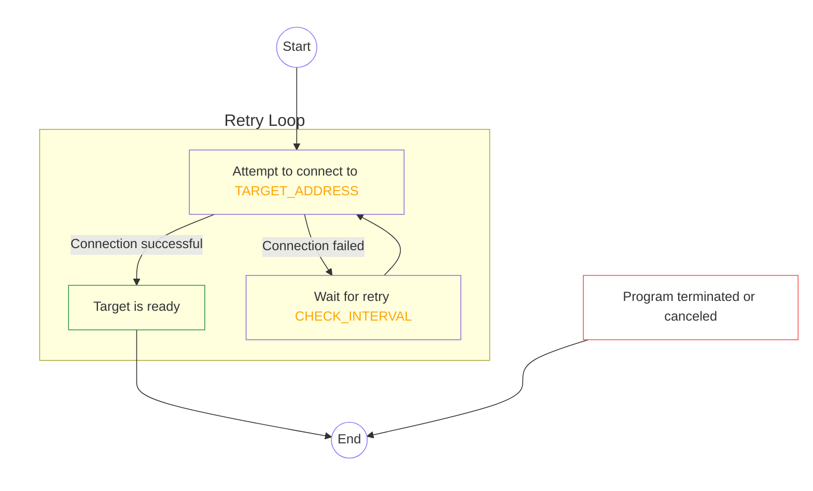
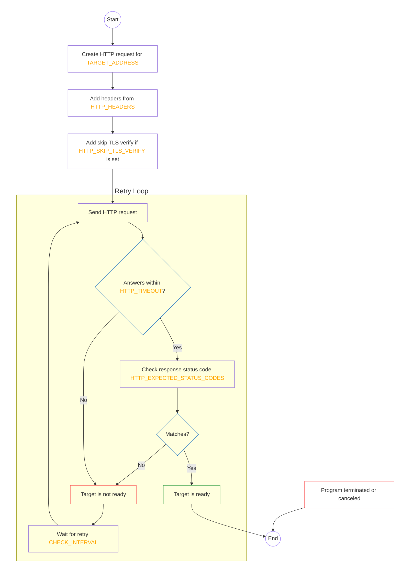
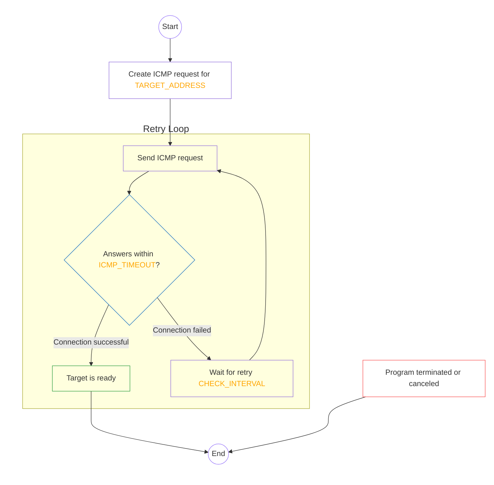

# N.E.V.E.R. - Network Endpoint Validation with Endless Retries

[](https://goreportcard.com/report/github.com/containeroo/never)
[](https://godoc.org/github.com/containeroo/never)
[](https://github.com/containeroo/never/releases/latest)
[](https://github.com/containeroo/never/releases/latest)

[](https://github.com/containeroo/never/actions/workflows/build.yml)
[](LICENSE)

---

> **N.E.V.E.R.** (Network Endpoint Validation with Endless Retries) is a lightweight Go application that obsessively checks whether a `TCP`, `HTTP`, or `ICMP` target is reachable.
> It loops endlessly until the target responds — or until it’s killed.

Designed to run as a **Kubernetes `initContainer`**, `N.E.V.E.R.` ensures your service dependencies are fully up before anything else gets a chance to boot.

## Features

- Continuously retries until the target responds.
- Supports multiple concurrent targets, each with its own config.
- Configurable via command-line flags or environment variables.
- Supports `HTTP`, `TCP`, and `ICMP` readiness checks.
- Supports per-target retry backoff and max attempts.
- Exits with `0` the moment everything is ready.
- Exits with `1` if any target exceeds `--max-attempts`.

Whether you're waiting on a `port`, `ping`, or a `200 OK`, `N.E.V.E.R.` backs down never.

## Configuration

Flags can also be set through environment variables.

The environment variable prefix is:

```text
NEVER__
```

Two underscores are used intentionally to avoid overlapping with common Kubernetes-style names such as `*_SVC`, `*_PORT`, or similar service-discovery variables.

Flag names are converted to environment variables by:

- removing the leading `--`
- replacing dots and hyphens with underscores
- uppercasing the name
- prefixing it with `NEVER__`

Examples:

| Flag                               | Environment variable                    |
| ---------------------------------- | --------------------------------------- |
| `--default-interval`               | `NEVER__DEFAULT_INTERVAL`               |
| `--max-attempts`                   | `NEVER__MAX_ATTEMPTS`                   |
| `--log-format`                     | `NEVER__LOG_FORMAT`                     |
| `--http.web.address`               | `NEVER__HTTP_WEB_ADDRESS`               |
| `--http.web.expected-status-codes` | `NEVER__HTTP_WEB_EXPECTED_STATUS_CODES` |
| `--tcp.db.timeout`                 | `NEVER__TCP_DB_TIMEOUT`                 |
| `--icmp.host.timeout`              | `NEVER__ICMP_HOST_TIMEOUT`              |

Command-line flags take precedence over environment variables.

## Command-Line Flags

`never` accepts the following command-line flags:

### Common Flags

| Flag                 | Env var                   | Type     | Default | Description                                                         |
| -------------------- | ------------------------- | -------- | ------- | ------------------------------------------------------------------- |
| `--default-interval` | `NEVER__DEFAULT_INTERVAL` | duration | `2s`    | Default interval between checks. Can be overridden for each target. |
| `--max-attempts`     | `NEVER__MAX_ATTEMPTS`     | int      | `-1`    | Maximum attempts before giving up. Use `-1` to retry endlessly.     |
| `--log-format`       | `NEVER__LOG_FORMAT`       | enum     | `json`  | Log output format: `json` or `text`.                                |
| `--version`          |                           | bool     | `false` | Show version and exit.                                              |
| `--help`, `-h`       |                           | bool     | `false` | Show help.                                                          |

### Target Flags

`never` accepts dynamic flags that can be defined in startup arguments or environment variables.

Use the following flag format:

```text
--<TYPE>.<IDENTIFIER>.<PROPERTY>=<VALUE>
```

Use the following environment variable format:

```text
NEVER__<TYPE>_<IDENTIFIER>_<PROPERTY>=<VALUE>
```

Types are:

- `http`
- `icmp`
- `tcp`

Examples:

```text
--http.web.address=http://example.com
NEVER__HTTP_WEB_ADDRESS=http://example.com
```

```text
--tcp.db.address=postgres.default.svc.cluster.local:5432
NEVER__TCP_DB_ADDRESS=postgres.default.svc.cluster.local:5432
```

```text
--icmp.host.address=example.com
NEVER__ICMP_HOST_ADDRESS=example.com
```

#### HTTP Flags

| Flag                                          | Type        | Default        | Description                                                                                                  |
| --------------------------------------------- | ----------- | -------------- | ------------------------------------------------------------------------------------------------------------ |
| `--http.<IDENTIFIER>.name`                    | string      | `<IDENTIFIER>` | Name of the HTTP checker.                                                                                    |
| `--http.<IDENTIFIER>.address`                 | string      | required       | HTTP target URL. \*                                                                                          |
| `--http.<IDENTIFIER>.interval`                | duration    | `0`            | Time between HTTP requests. Uses `--default-interval` when unset or `0`.                                     |
| `--http.<IDENTIFIER>.max-attempts`            | int         | `0`            | Maximum attempts before giving up. Uses `--max-attempts` when unset or `0`.                                  |
| `--http.<IDENTIFIER>.backoff`                 | enum        | `linear`       | Retry backoff mode. Allowed values: `linear`, `exponential`.                                                 |
| `--http.<IDENTIFIER>.max-interval`            | duration    | `0`            | Maximum retry interval when backoff increases the delay. Uncapped when unset or `0`.                         |
| `--http.<IDENTIFIER>.method`                  | enum        | `GET`          | HTTP method. Allowed values: `GET`, `HEAD`, `POST`, `PUT`, `PATCH`, `DELETE`, `CONNECT`, `OPTIONS`, `TRACE`. |
| `--http.<IDENTIFIER>.header`                  | string list | empty          | HTTP header in `KEY=VALUE` format. Can be passed multiple times as a flag. Header values can be resolved. \* |
| `--http.<IDENTIFIER>.allow-duplicate-headers` | bool        | `false`        | Allow duplicate HTTP headers.                                                                                |
| `--http.<IDENTIFIER>.expected-status-codes`   | string list | `200`          | Expected HTTP status codes. Supports comma-separated codes and ranges, for example `200,204,301-302`.        |
| `--http.<IDENTIFIER>.skip-tls-verify`         | bool        | `false`        | Skip TLS certificate verification.                                                                           |
| `--http.<IDENTIFIER>.timeout`                 | duration    | `2s`           | HTTP request timeout.                                                                                        |

Environment variables use `NEVER__HTTP_<IDENTIFIER>_<PROPERTY>`.
Example: `--http.web.address` becomes `NEVER__HTTP_WEB_ADDRESS`.

#### ICMP Flags

| Flag                                | Type     | Default        | Description                                                                                         |
| ----------------------------------- | -------- | -------------- | --------------------------------------------------------------------------------------------------- |
| `--icmp.<IDENTIFIER>.name`          | string   | `<IDENTIFIER>` | Name of the ICMP checker.                                                                           |
| `--icmp.<IDENTIFIER>.address`       | string   | required       | ICMP target hostname or IP address. \*                                                              |
| `--icmp.<IDENTIFIER>.interval`      | duration | `0`            | Time between ICMP requests. Uses `--default-interval` when unset or `0`.                            |
| `--icmp.<IDENTIFIER>.max-attempts`  | int      | `0`            | Maximum attempts before giving up. Uses `--max-attempts` when unset or `0`.                         |
| `--icmp.<IDENTIFIER>.backoff`       | enum     | `linear`       | Retry backoff mode. Allowed values: `linear`, `exponential`.                                        |
| `--icmp.<IDENTIFIER>.max-interval`  | duration | `0`            | Maximum retry interval when backoff increases the delay. Uncapped when unset or `0`.                |
| `--icmp.<IDENTIFIER>.timeout`       | duration | `2s`           | Timeout for ICMP read and write operations.                                                         |
| `--icmp.<IDENTIFIER>.read-timeout`  | duration | `0`            | Advanced override for the ICMP read timeout. Uses `--icmp.<IDENTIFIER>.timeout` when unset or `0`.  |
| `--icmp.<IDENTIFIER>.write-timeout` | duration | `0`            | Advanced override for the ICMP write timeout. Uses `--icmp.<IDENTIFIER>.timeout` when unset or `0`. |

Environment variables use `NEVER__ICMP_<IDENTIFIER>_<PROPERTY>`.
Example: `--icmp.host.address` becomes `NEVER__ICMP_HOST_ADDRESS`.

#### TCP Flags

| Flag                              | Type     | Default        | Description                                                                          |
| --------------------------------- | -------- | -------------- | ------------------------------------------------------------------------------------ |
| `--tcp.<IDENTIFIER>.name`         | string   | `<IDENTIFIER>` | Name of the TCP checker.                                                             |
| `--tcp.<IDENTIFIER>.address`      | string   | required       | TCP target address in `host:port` format. \*                                         |
| `--tcp.<IDENTIFIER>.timeout`      | duration | `2s`           | TCP connection timeout.                                                              |
| `--tcp.<IDENTIFIER>.interval`     | duration | `0`            | Time between TCP requests. Uses `--default-interval` when unset or `0`.              |
| `--tcp.<IDENTIFIER>.max-attempts` | int      | `0`            | Maximum attempts before giving up. Uses `--max-attempts` when unset or `0`.          |
| `--tcp.<IDENTIFIER>.backoff`      | enum     | `linear`       | Retry backoff mode. Allowed values: `linear`, `exponential`.                         |
| `--tcp.<IDENTIFIER>.max-interval` | duration | `0`            | Maximum retry interval when backoff increases the delay. Uncapped when unset or `0`. |

Environment variables use `NEVER__TCP_<IDENTIFIER>_<PROPERTY>`.
Example: `--tcp.db.address` becomes `NEVER__TCP_DB_ADDRESS`.

## Resolving Variables

Some flag values can be resolved from environment variables, files, JSON, YAML, and INI files.

Fields marked with `*` in the flag tables support resolving variables.

This is separate from `NEVER__...` flag environment variables.

| Prefix  | Source               | Example                                | Description                                                               |
| ------- | -------------------- | -------------------------------------- | ------------------------------------------------------------------------- |
| `env:`  | Environment variable | `env:PATH`                             | Resolves the value from an environment variable.                          |
| `file:` | Key-value file       | `file:/config/app.txt//KeyName`        | Resolves `KeyName` from a simple key-value file.                          |
| `json:` | JSON file            | `json:/config/app.json//database.host` | Resolves a value from a JSON file. Supports dot notation for nested keys. |
| `yaml:` | YAML file            | `yaml:/config/app.yaml//server.port`   | Resolves a value from a YAML file. Supports dot notation for nested keys. |
| `ini:`  | INI file             | `ini:/config/app.ini//Section.Key`     | Resolves a value from an INI file section and key.                        |
| none    | Literal value        | `http://example.com`                   | Uses the value as-is.                                                     |

HTTP header values can also be resolved using the same mechanism:

```sh
never \
  --http.web.address=http://example.com \
  --http.web.header="Authorization=env:SECRET_HEADER"
```

## Examples

### Define an HTTP Target with Flags

```sh
never \
  --http.web.address=http://example.com:80 \
  --http.web.method=GET \
  --http.web.expected-status-codes=200,204 \
  --http.web.header="Authorization=Bearer token" \
  --http.web.header="Content-Type=application/json" \
  --http.web.skip-tls-verify=false \
  --default-interval=5s
```

### Define an HTTP Target with Environment Variables

```sh
NEVER__DEFAULT_INTERVAL=5s \
NEVER__HTTP_WEB_ADDRESS=http://example.com:80 \
NEVER__HTTP_WEB_METHOD=GET \
NEVER__HTTP_WEB_EXPECTED_STATUS_CODES=200,204 \
NEVER__HTTP_WEB_HEADER="Authorization=Bearer token" \
NEVER__HTTP_WEB_SKIP_TLS_VERIFY=false \
never
```

### Define Multiple Targets Running in Parallel

```sh
never \
  --http.web.address=http://example.com:80 \
  --tcp.db.address=localhost:5432 \
  --tcp.db.backoff=exponential \
  --tcp.db.max-interval=30s \
  --icmp.host.address=example.com \
  --default-interval=10s
```

### Define Multiple Targets with Environment Variables

```sh
NEVER__DEFAULT_INTERVAL=10s \
NEVER__HTTP_WEB_ADDRESS=http://example.com:80 \
NEVER__TCP_DB_ADDRESS=localhost:5432 \
NEVER__TCP_DB_BACKOFF=exponential \
NEVER__TCP_DB_MAX_INTERVAL=30s \
NEVER__ICMP_HOST_ADDRESS=example.com \
never
```

## Notes

**Proxy Settings**: Proxy configurations (`HTTP_PROXY`, `HTTPS_PROXY`, `NO_PROXY`) are managed via standard environment variables used by Go's HTTP client.

## Behavior Flowchart

### TCP Check

<details>
  <summary>Click here to see the flowchart</summary>



</details>

### HTTP Check

<details>
  <summary>Click here to see the flowchart</summary>



</details>

### ICMP Check

<details>
  <summary>Click here to see the flowchart</summary>



</details>

## Permissions

Only `ICMP` checks in Kubernetes require additional permissions. The container needs the `CAP_NET_RAW` capability to send ICMP packets.

Example:

```yaml
- name: wait-for-host
  image: ghcr.io/containeroo/never:latest
  args:
    - --icmp.host.address=hostname.domain.com
    - --icmp.host.timeout=2s
  securityContext:
    readOnlyRootFilesystem: true
    allowPrivilegeEscalation: false
    capabilities:
      add: ["CAP_NET_RAW"]
```

For `TCP` and `HTTP` checks, the container does not require any additional permissions.

## Kubernetes initContainer Configuration

Configure your Kubernetes deployment to use `never` as an init container.

### Using Args

```yaml
initContainers:
  - name: wait-for-vm
    image: ghcr.io/containeroo/never:latest
    args:
      - --icmp.vm.address=hostname.domain.tld
      - --icmp.vm.timeout=2s
    securityContext:
      readOnlyRootFilesystem: true
      allowPrivilegeEscalation: false
      capabilities:
        add: ["CAP_NET_RAW"]

  - name: wait-for-services
    image: ghcr.io/containeroo/never:latest
    args:
      - --http.postgres.address=http://postgres.default.svc.cluster.local:9000/healthz
      - --http.postgres.method=POST
      - --http.postgres.header=Authorization=env:BEARER_TOKEN
      - --http.postgres.expected-status-codes=200,202
      - --tcp.redis.name=redis
      - --tcp.redis.address=redis.default.svc.cluster.local:6379
      - --tcp.vaultkey.address=valkey.default.svc.cluster.local:6379
      - --tcp.vaultkey.interval=5s
      - --tcp.vaultkey.timeout=5s
    envFrom:
      - secretRef:
          name: bearer-token
```

### Using Environment Variables

```yaml
initContainers:
  - name: wait-for-services
    image: ghcr.io/containeroo/never:latest
    env:
      - name: NEVER__DEFAULT_INTERVAL
        value: 5s

      - name: NEVER__HTTP_POSTGRES_ADDRESS
        value: http://postgres.default.svc.cluster.local:9000/healthz
      - name: NEVER__HTTP_POSTGRES_METHOD
        value: POST
      - name: NEVER__HTTP_POSTGRES_HEADER
        value: Authorization=env:BEARER_TOKEN
      - name: NEVER__HTTP_POSTGRES_EXPECTED_STATUS_CODES
        value: 200,202

      - name: NEVER__TCP_REDIS_NAME
        value: redis
      - name: NEVER__TCP_REDIS_ADDRESS
        value: redis.default.svc.cluster.local:6379

      - name: NEVER__TCP_VAULTKEY_ADDRESS
        value: valkey.default.svc.cluster.local:6379
      - name: NEVER__TCP_VAULTKEY_INTERVAL
        value: 5s
      - name: NEVER__TCP_VAULTKEY_TIMEOUT
        value: 5s
    envFrom:
      - secretRef:
          name: bearer-token
```

## License

This project is licensed under the Apache License. See the [LICENSE](LICENSE) file for details.
